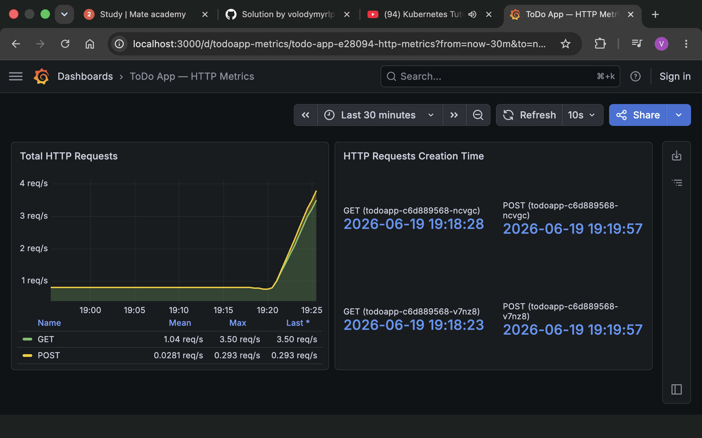

# Monitoring the ToDo App with Prometheus & Grafana

This document describes the monitoring solution added on top of the Django ToDo
List application: a Prometheus‑compatible `/metrics` endpoint, a `todoapp` Helm
chart with a `ServiceMonitor`, and a Grafana dashboard.

The lab was run on a local **kind** cluster (`cluster.yml`, 1 control‑plane + 6
workers) using OrbStack's Docker engine on macOS.

## 1. Application changes

### `/metrics` endpoint
A counter of HTTP requests, labelled by method, is exposed at `/metrics` in the
Prometheus text exposition format.

| File | Change |
|------|--------|
| `src/todolist/metrics.py` | New `http_requests_total{method}` counter, an explicit `http_requests_created_timestamp_seconds{method}` gauge (creation/reset time), `PrometheusMetricsMiddleware`, and `metrics_view`. |
| `src/todolist/settings.py` | Registered `todolist.metrics.PrometheusMetricsMiddleware`. |
| `src/todolist/urls.py` | Added `path("metrics", metrics_view)` (served at `/metrics`, **not** `/api/metrics`). |
| `src/requirements.txt` | Added `prometheus_client==0.20.0` (installed during the Docker build). |

Sample output:

```
# HELP http_requests_total Total number of HTTP requests handled by the application.
# TYPE http_requests_total counter
http_requests_total{method="GET"} 30.0
http_requests_total{method="POST"} 2.0
# HELP http_requests_created_timestamp_seconds Unix timestamp when the HTTP request counter for each method was created or reset.
# TYPE http_requests_created_timestamp_seconds gauge
http_requests_created_timestamp_seconds{method="GET"} 1.7818858883e+09
http_requests_created_timestamp_seconds{method="POST"} 1.7818859686e+09
```

Scrapes of `/metrics` are excluded from the counter to avoid self‑inflation.

## 2. Build & load the image

```bash
docker build -t todoapp:metrics ./src
kind load docker-image todoapp:metrics --name kind
```

## 3. kube-prometheus-stack

Installed via Helm into the `monitoring` namespace:

```bash
helm repo add prometheus-community https://prometheus-community.github.io/helm-charts
helm repo update
helm install kube-prometheus-stack prometheus-community/kube-prometheus-stack -n monitoring --create-namespace
```

The Prometheus instance discovers `ServiceMonitor`s carrying the
`release: kube-prometheus-stack` label, which our chart sets.

## 4. The `todoapp` Helm chart

Located in [`helm/todoapp`](../helm/todoapp). Templates:

- `deployment.yaml` – runs `todoapp:metrics`, container port `8080` named `http`,
  DB creds from a `Secret`, liveness `/api/health`, readiness `/api/ready`.
- `service.yaml` – exposes the named **`http`** port (the ServiceMonitor selects it)
  and a NodePort `30007` for browsing.
- `servicemonitor.yaml` – scrapes `path: /metrics`, `port: http`, `interval: 10s`.
- `configmap.yaml` / `secret.yaml` – app config and DB connection
  (`mysql-0.mysql.mysql.svc.cluster.local`).

`values.yaml` carries the `serviceMonitor` block required by the task:

```yaml
serviceMonitor:
  enabled: true
  labels: {}
  interval: 10s
  path: /metrics
  port: http
```

Install:

```bash
helm install todoapp ./helm/todoapp -n todoapp
```

## 5. Verify scraping

```bash
kubectl -n monitoring port-forward svc/kube-prometheus-stack-prometheus 9090:9090
# open http://localhost:9090/targets  ->  serviceMonitor/todoapp/todoapp-service-monitor  =  2/2 up
```

## 6. Grafana dashboard

The dashboard model is committed at
[`monitoring/grafana/todoapp-dashboard.json`](../monitoring/grafana/todoapp-dashboard.json)
and can be imported into Grafana (Dashboards → Import).

| Panel | Query |
|-------|-------|
| **Total HTTP Requests** | `sum(rate(http_requests_total[5m])) by (method)` |
| **HTTP Requests Creation Time** | `http_requests_created_timestamp_seconds * 1000` (an explicit Gauge set when each method's counter is first created; rendered with the `dateTimeAsIso` unit so the reset time is human‑readable) |


